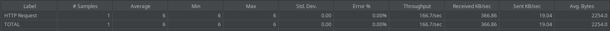
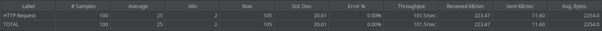
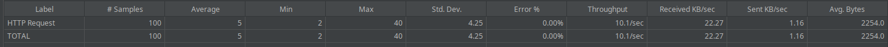
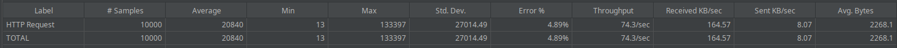
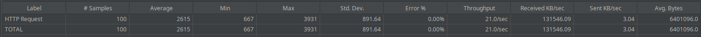
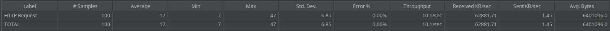
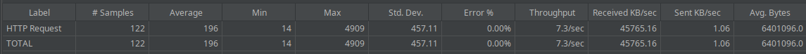
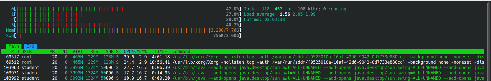

# PRÁCTICA 1

## Introducción
En esta práctica, hemos creado una página web que muestra 6 vídeos almacenados localmente, que en realidad se trata del mismo vídeo repetido. El objetivo es analizar los cuellos de botella y la complejidad de nuestro servicio, así como realizar pruebas de carga utilizando la heramienta de JMeter.

## Pruebas de carga:
Para evaluar el rendimiento de nuestro servicio de video bajo diferentes niveles de carga, hemos utilizado Apache JMeter, una herramienta de código abierto diseñada específicamente para realizar pruebas de carga y medir el rendimiento de aplicaciones web y otros servicios.

JMeter nos permite simular múltiples usuarios accendiendo simultáneamente a la aplicación, enviando peticiones al servidor para medir cómo responde bajo distintas condiciones de carga. El objetivo de estas pruebas es comprender mejor los límites de nuestro sistema y verificar su estabilidad al simular un ambiente de uso real. Con JMeter, hemos definido diferentes tipos de peticiones, hemos configurado el número de usuarios y hemos indicado el tiempo de duración de las peticiones.

1. **Definición de peticiones**: Hemos definido las peticiones necesarias para evaluar el rendimiento de nuestra página web, que simula un servicio de vídeo streaming. Esto incluye la carga de la página principal y las solicitudes para reproducir el vídeo.
    - **Petición 1:** Esta solicitud mide cómo el servidor gestiona las solicitudes para cargar la página principal.
    ```
    GET http://127.0.0.1:5000/
    ```
    - **Petición 2:** Esta solicitud evalúa la capacidad del servidor para manejar múltiples peticiones simultáneas para la transmisión de vídeo.
    ```
    GET http://127.0.0.1:5000/static/video/videoStreaming.mp4
    ```

2. **Variación del número de usuarios y tiempo**: Hemos realizado pruebas variando el número de usuarios simultáneos y el tiempo de duración de las pruebas:

- **Pruebas sobre la petición 1:**
  - **Número de usuarios: 1 (en 1 segundo):** 
  Con un solo usuario, el tiempo de respuesta es muy bajo y consistente lo que indica que el sistema gestiona bien una única solicitud.

    

  - **Número de usuarios: 10 (en 1 segundo):**
  Con 10 usuarios, el tiempo de respuesta promedio aumenta ligeramente y la desviación estándar también aumenta, lo que sugiere una mayor variabilidad en los tiempos de respuesta.

    

  - **Número de usuarios: 100 (en 1 segundo):**
  Con 100 usuarios, el tiempo de respuesta promedio aumenta significativamente y la desviación estándar es mucho mayor, indicando una mayor variabilidad y posibles cuellos de botella en el sistema. A pesar de eso, el throughput es razonablemente alto.

    

  - **Número de usuarios: 100 (en 10 segundos):**
  Con 100 usuarios en 10 segundos, tanto el tiempo de respuesta promedio y la desviación disminuyen significativamente al aumentar el tiempo a 10 segundos.

    

  - **Número de usuarios: 1000 (en 1 segundo):**
  Con 1000 usuarios en un segundo, el tiempo de respuesta promedio y la desviación estándar son muy altos pero todavía no hay errores.

    

  - **Número de usuarios: 1000 (en 10 segundos):**
  Con 1000 usuarios en 10 segundos, podemos apreciar que el tiempo de respuesta promedio baja ligeramente (de 1.877 segundos a 1.644 segundos).

    
    
  - **Número de usuarios: 10000 (en 1 segundo):**
  Con 10000 usuarios en 1 segundo, podemos apreciar errores y tiempos muy altos (de 20 segundos).

    
    
  - **Número de usuarios: 10000 (en 10 segundos):**
  Con 10000 usuarios en 10 segundos, sería un poco mejor que en el caso anterior en cuanto al tiempo, pero todavía sigue siendo muy alto para la carga de una página web y podemos ver que se han producio un 3% de errores.

    
    
En resumen, a medida que aumenta el número de usuarios, el tiempo de respuesta promedio y la variabilidad en los tiempos de respuesta también aumentan. Esto es esperado, ya que el sistema tiene que manejar más solicitudes simultáneamente. Y podemos apreciar que 10.000 usuarios en 1 o 10 segundo sería demasiado para el servidor y que empezaríamos a tener errores. Lo más normal sería que esos 10.000 usuarios no accedieran todos a la vez en 1 o 10 segundos, por lo que un tiempo razonable para las solcitudes de ese número de usuarios podría ser 1 minuto. En nuestro caso, lo hemos querido llevar al extremo para ver cuando realmente empezaba a fallar.

- **Pruebas sobre la petición 2:**
  En este caso, los bytes han aumentado mucho, ya que el servidor maneja múltiples peticiones simultáneas para la transimisión de video. Por eso mismo podemos apreciar peores resultados en cuanto en la respuesta del servidor.

  - **Número de usuarios: 1 (en 1 segundo):**
  Con un único usuario el tiempo de respuesta sigue siendo bajo, pero se aprecia que comparando con la petición 1, el número de bytes enviados es mucho mayor.

    

  - **Número de usuarios: 10 (en 1 segundo):**
  Con 10 usuarios el tiempo de respuesta promedio aumenta ligeramente al igual que la desviación estandar.

    

  - **Número de usuarios: 100 (en 1 segundo):**
  Esta vez, con 100 usuarios en 1 segundo se ve como el tiempo de respuesta se dispara, indicando posibles cuellos de botella. 

    
  
  - **Número de usuarios: 100 (en 10 segundos):**
  Esta vez, teniendo 10 segundos para gestionar las 100 peticiones en vez de 1 segundo, vuelve a tiempos de respuesta más razonables comparable al escenario de 10 usuarios en 1 segundo.

    

  - **Número de usuarios: 1000 (en 100 segundos):**
  En este caso, la CPU se satura y se bloquea la herramienta JMeter, lo que demuestra que el sistema no puede manejar esta carga.

    

  - **Número de usuarios: 1000 (en 100 segundos):**
  Aunque se ha aumentado el tiempo, la CPU sigue saturándose y JMeter se bloquea, confirmando que el cuello de botella está en la CPU.

    

En resumen, se puede apreciar un resultado similar al visto en la petición 1, cuando aumenta el número de usuarios, el rendimiento es peor y en este caso aún más exagerado, ya que no es una simple carga de una página web, si no es la descarga de un vídeo. Además, con muchos usuarios (1000 en nuestro caso) la CPU se satura.

3. **Análisis del lado del cliente y del servidor**: 
Las pruebas se centran en el comportamiento del cliente al realizar peticiones y la capacidad del servidor para manejar dichas solicitudes. En nuesto caso, las pruebas se han realizado sobre un mismo equipo, por lo que ha actuado tanto de cliente como de servidor. Esta configuración nos permite  analizar tanto el impacto de las solicitudes en el cliente como la carga en el servidor, observando cómo el sistema gestiona el procesamiento de múltiples usuarios simulados.
Para evaluar el rendimiento de CPU durante las pruebas, hemos utilizado la herramienta htop, que permite visualizar el uso de los recursos en tiempo real.
  - **Rendimiento de la CPU:**
  En nuestras pruebas iniciales, con pocos usuarios realizando peticiones, el rendimiento de la CPU es aceptable y el sistema responde con rapidez. Sin embargo, al incrementar el número de usuarios, se observa una saturación progresiva de la CPU, por lo que se puede observar que la CPU es un cuello de botella claro en nuestro caso. Esto significa que la capacidad de procesamiento del sistema no es suficiente para manejar altas cargas simultáneas, lo que impacta negativamente en los tiempos de respuesta y en la estabilidad general del servidor.
    - **Rendimiento con pocos usuarios:**

        
    - **Rendimiento con muchos usuarios:**

        
 
## Principales cuellos de botella:
Los cuellos de botella limitan el rendimiento y pueden afectar la experiencia del usuario. En nuestro caso, hemos identificado los siguientes cuellos de botella:
1. **CPU**: La capacidad de procesamiento del servidor es muy importante para manejar múltiples solicitudes simultáneas y mantener una respuesta rápida. Si la CPU se satura, los tiempos de carga se incrementan y el sistema puede volverse inestable, como se ha visto en las pruebas de carga.

2. **Capacidad del servidor**: La capacidad de respuesta del servidor puede disminuir si no es capaz de procesar el volumen de solicitudes simultáneas, resultando en mayores tiempos de respuesta o, en casos extremos, la caída del servicio.

3. **Ancho de banda**: La transmisión de vídeo consume una cantidad considerable de ancho de banda. Si múltiples usuarios intentan acceder a los videos simultáneamente, esto podría saturar la conexión a Internet y provocar interrupciones en la reproducción.

4. **Codificación y compresión de vídeo**: La calidad y el formato del video también afectan la rapidez con la que se puede transmitir. Vídeos en alta definición requieren más recursos y ancho de banda que aquellos en resolución estándar.

5. **Tiempo de carga de la página**: La carga inicial de la página también es un cuello de botella si se están cargando múltiples recursos pesados, como imágenes y videos.

## Análisis de complejidad
En este apartado se analizan dos aspectos fundamentales de la complejidad del servicio: **complejidad temporal** y **complejidad espacial**. Esto implica evaluar cómo el servicio maneja un crecimiento en el número de usuarios **(n)** y cómo afectan estos incrementos tanto en el tiempo de respuesta como en la transmisión de datos.

### A. Complejidad temporal

La complejidad temporal se refiere a cómo aumenta el tiempo de servicio conforme incrementa el número de usuarios que acceden simultáneamente. Para este análisis, se han tomado muestras de los tiempos de respuesta promedio (n usuarios en 1 segundo) tanto para la primera como para la segunda petición. Los tiempos obtenidos se representan en la gráfica, donde cada punto corresponde al tiempo de respuesta promedio para un número específico de usuarios.


Al observar las curvas en la gráfica:
  - La **Petición 1** muestra un aumento de tiempos que sigue una forma polinómica (posiblemente cuadrática o de grado menor en términos de complejidad), aunque se observa un aumento significativo en tiempos para volúmenes altos de usuarios.
  
  - En el caso de la **Petición 2**, el crecimiento en tiempos de respuesta es aún más pronunciado, lo que sugiere una complejidad de mayor grado que la de la Petición 1. Esta diferencia se debe a que la Petición 2 implica la transmisión de un archivo de vídeo, una operación que consume considerablemente más recursos y tiempo, especialmente cuando el número de usuarios simultáneos aumenta.

En conclusión, ambas curvas pueden modelarse como complejidades polinómicas **O(n<sup>i</sup>)**, donde el grado **"i"** de la Petición 2 es mayor que el de la Petición 1 debido a la sobrecarga adicional en el procesamiento y transmisión de contenido multimedia.

### B. Complejidad espacial

La complejidad espacial analiza el consumo de espacio, o en este caso, el **volumen de datos transmitidos** en función del número de usuarios simultáneos. Se ha evaluado el número de bytes promedio transmitidos por cada solicitud y cómo este número escala con el aumento de usuarios.

Observando los datos de transmisión:
  - El tamaño en bytes promedio por solicitud es constante, es decir, cada usuario recibe una cantidad fija de datos al solicitar el contenido. Por lo tanto, la **complejidad espacial** se puede considerar **constante (O(1))**.

  - Cuando el número de usuarios aumenta por un factor de **(n)**, los datos transmitidos también aumentan en proporción directa a **(n)**. Esto implica que, aunque la carga de datos transmitidos escala con el número de usuarios, el crecimiento es lineal **(O(n))** y no se observan aumentos superlineales en el uso de recursos de red.

## Explicación:
En esta prueba de carga se ha realizado tanto el lado del cliente como el lado del servidor desde un mismo equipo, por lo que el rendimiento de la CPU ha ido peor también, ya que al final está lanzando la aplicación web y a la vez realizando la prueba de carga con JMeter.
En las siguientes prácticas probaremos a correr desde un equipo la aplicación web, haciendo de servidor, y después con otros equipos lanzar peticiones sobre este servidor. De esta forma, se podrá ver mejor el rendimiento en cada uno de los lados.

## Referencias:
- [JMeter](https://jmeter.apache.org)
