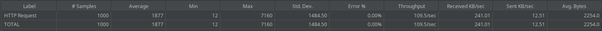
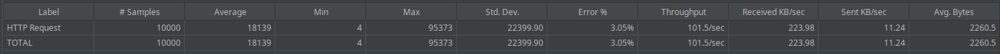
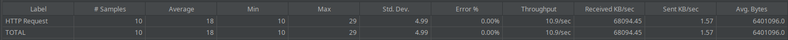
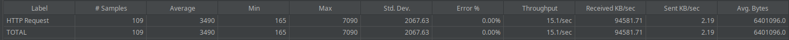

# PRÁCTICA 1

## Introducción
En esta práctica, hemos creado una página web que muestra 6 vídeos almacenados localmente, que en realidad se trata del mismo vídeo repetido. El objetivo es analizar los cuellos de botella y la complejidad de nuestro servicio, así como realizar pruebas de carga utilizando la heramienta de JMeter.

## Principales cuellos de botella:
Los cuellos de botella limitan el rendimiento y pueden afectar la experiencia del usuario. En nuestro caso, hemos identificado los siguientes cuellos de botella:
1. **CPU**: La capacidad de procesamiento del servidor es muy importante para manejar múltiples solicitudes simultáneas y mantener una respuesta rápida. Si la CPU se satura, los tiempos de carga se incrementan y el sistema puede volverse inestable.

2. **Capacidad del servidor**: La capacidad de respuesta del servidor puede disminuir si no es capaz de procesar el volumen de solicitudes simultáneas, resultando en mayores tiempos de respuesta o, en casos extremos, la caída del servicio.

3. **Ancho de banda**: La transmisión de vídeo consume una cantidad considerable de ancho de banda. Si múltiples usuarios intentan acceder a los videos simultáneamente, esto podría saturar la conexión a Internet y provocar interrupciones en la reproducción.

4. **Codificación y compresión de vídeo**: La calidad y el formato del video también afectan la rapidez con la que se puede transmitir. Vídeos en alta definición requieren más recursos y ancho de banda que aquellos en resolución estándar.

5. **Tiempo de carga de la página**: La carga inicial de la página puede ser un cuello de botella si se están cargando múltiples recursos pesados, como imágenes y videos.

## Complejidad:
Explicar la complejidad **(FALTA POR TERMINAR)**

## Pruebas de carga:
1. **Definición de peticiones**: Hemos definido las solicitudes necesarias para evaluar el rendimiento de nuestra página web, que simula un servicio de vídeo streaming. Esto incluye la carga de la página principal y las solicitudes para reproducir el vídeo.
    - **Petición 1:** Esta solicitud mide cómo el servidor gestiona las solicitudes para cargar la página principal.
    ```
    GET http://127.0.0.1:5000/
    ```
    - **Petición 2:** Esta solicitud evalúa la capacidad del servidor para manejar múltiples peticiones simultáneas para la transmisión de vídeo.
    ```
    GET http://127.0.0.1:5000/static/video/videoStreaming.mp4
    ```

2. **Variación del número de usuarios y tiempo**: Hemos realizado pruebas variando el número de usuarios simultáneos y el tiempo de duración de las pruebas:
    - **Pruebas sobre la petición 1:**
        - **Número de usuarios: 1 (en 1 segundo):**
            
        - **Número de usuarios: 10 (en 1 segundo):**
            
        - **Número de usuarios: 100 (en 1 segundo):**
            
        - **Número de usuarios: 100 (en 10 segundos):**
            
        - **Número de usuarios: 1000 (en 1 segundo):**
            
        - **Número de usuarios: 1000 (en 10 segundos):**
            
        - **Número de usuarios: 10000 (en 1 segundo):**
            
        - **Número de usuarios: 10000 (en 10 segundos):**
            

    - **Prueba sobre la petición 2:**
        - **Número de usuarios: 1 (en 1 segundo):**
            
        - **Número de usuarios: 10 (en 1 segundo):**
            
        - **Número de usuarios: 100 (en 1 segundo):**
            
        - **Número de usuarios: 100 (en 10 segundos):**
            
        - **Número de usuarios: 1000 (en 100 segundos):**
        En este caso, la CPU se satura y se bloquea la herramienta JMeter, lo que demuestra que el sistema no puede manejar esta carga.
            
        - Número de usuarios: 1000 (en 100 segundos)
        Aunque se ha aumentado el tiempo, la CPU sigue saturándose y el JMeter se bloquea, confirmando que el cuello de botella es claramente la CPU.
            

3. **Análisis del lado del cliente y del servidor**: Las pruebas se centran en el comportamiento del cliente al realizar peticiones y la capacidad del servidor para manejar dichas solicitudes. En nuesto caso, las pruebas se han realizado sobre un mismo equipo, por lo que ha actuado tanto de cliente como de servidor.
    - **Rendimiento de la CPU:**
    Cuando tenemos pocos usuarios, el rendimiento de la CPU es aceptable, pero al aumentar el número de usuarios, la CPU se satura, por lo que se puede observar que la CPU es un cuello de botella claro en nuestro caso.
        - **Rendimiento con pocos usuarios**
            
        - **Rendimiento con muchos usuarios**
            

## Explicación:
En esta prueba de carga se ha realizado tanto el lado del cliente como el lado del servidor desde un mismo equipo, por lo que el rendimiento de la CPU ha ido peor también, ya que al final está lanzando la aplicación web y a la vez realizando la prueba de carga con JMeter.
En las siguientes prácticas probaremos a correr desde un equipo la aplicación web, haciendo de servdidor, y después con otros equipos lanzar peticiones sobre este servdidor. De esta forma, se podrá ver mejor el rendimiento en cada uno de los lados.

## Referencias:
- [JMeter](https://jmeter.apache.org)