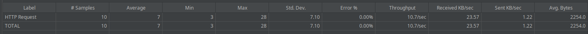
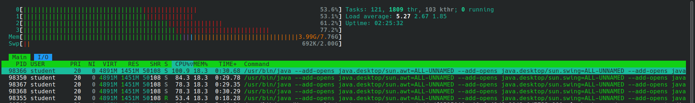

# PRÁCTICA 1

## Introducción
En esta práctica, hemos creado una página web que muestra 6 vídeos almacenados localmente, que en realidad se trata del mismo vídeo repetido. El objetivo es analizar los cuellos de botella y la complejidad de nuestro servicio, así como realizar pruebas de carga utilizando la heramienta de JMeter.

## Principales cuellos de botella:
Los cuellos de botella limitan el rendimiento y pueden afectar la experiencia del usuario. En nuestro caso, hemos identificado los siguientes cuellos de botella:
1. **CPU**: La capacidad de procesamiento del servidor es muy importante para manejar múltiples solicitudes simultáneas y mantener una respuesta rápida. Si la CPU se satura, los tiempos de carga se incrementan y el sistema puede volverse inestable.

2. **Capacidad del servidor**: La capacidad de respuesta del servidor puede disminuir si no es capaz de procesar el volumen de solicitudes simultáneas, resultando en mayores tiempos de respuesta o, en casos extremos, la caída del servicio.

3. **Ancho de banda**: La transmisión de vídeo consume una cantidad considerable de ancho de banda. Si múltiples usuarios intentan acceder a los videos simultáneamente, esto podría saturar la conexión a Internet y provocar interrupciones en la reproducción.

4. **Codificación y compresión de vídeo**: La calidad y el formato del video también afectan la rapidez con la que se puede transmitir. Vídeos en alta definición requieren más recursos y ancho de banda que aquellos en resolución estándar.

5. **Tiempo de carga de la página**: La carga inicial de la página puede ser un cuello de botella si se están cargando múltiples recursos pesados, como imágenes y videos.

## Complejidad:
La complejidad de este sistema radica en varios factores que intervienen en el rendimiento y la respuesta del servicio bajo diferentes cargas de usuarios. Estos factores se dividen componentes técnicos y de rendimiento.

1. **Escalabilidad del Servidor**: A medida que aumentamos el número de usuarios concurrentes, el servidor debe ser capaz de gestionar más solicitudes sin degradar su rendimiento. Esto incluye tanto la capacidad de la CPU para procesar múltiples peticiones como la memoria disponible para soportar estas operaciones. A medida que la carga aumenta, la necesidad de recursos se incrementa exponencialmente, lo que hace que mantener la escalabidad del sistema sea un reto.

2. **Manejo de Ancho de Banda**: La transmisión de video es un proceso intensivo de ancho de banda. En un entorno de carga pesada, donde varios usuarios acceden simultáneamente al video, el ancho de banda disponible puede no ser suficiente, generando interrupcines en la reproducción. Gestionar el ancho de banda de manera eficiente y, si es posible, implementar técnicas de compresión o escalabilidad dinámica es esencial para evitar una degradación en la experiencia de usuario.

3. **Codificación y Compresión de Video**: La calidad y el formato del video afectan el tamaño de los archivos, y por lo tanto, la rapidez con la que estos puede ser transmitidos. Los videos en alta definición requieren más recursos y ancho de banda, lo que aumenta la complejidad del sistema al tener que equilibrar la calidad con la eficiencia en la transmisión.

4. **Concurrencia y Sincronización**: La concurrencia de múltiples usuarios simultaneamente solicita procesos de sincronización, gestión de sesiones y acceso controlado a los recursos. En situaciones de alta concurrencia, si el servidor no gestiona adecuadamente las solicitudes, podría experimentar un aumento en los tiempos de espera o incluso colapsar.

5. **Complejida del Tiempo de Respuesta**: El tiempo de respuesta en la página inicial es un factor crucial. Con cada usuario que carga la página, el sistema debe responder de inmediato, procesar imágenes y videos, y hacer el contenido esté disponible rápidamente. Este factor se vuelve má compleko a medida que la cantidad de usuarios aumenta y el servidor necesita realizar más cálculos en menos tiempo.

6. **Optimización de Recursos en JMeter**: La herramienta de JMeter se utiliza para simular y analizar estas cargas, pero también introduce su propia complejidad. Para obtener datos representativos, JMeter debe estar configuraado para manejar altos volumenes de tráfico de manera efectiva, lo que requiere una configuración precisa de los hilos de ejecución, el tiempo de espera y los puntos de interrupción para evaluar correctamente el desempeño del sistema bajo pruebas de carga.

En conjunto, estos factores generan una arquitectura de alto grado de complejidad. Mantener un balance entre eficiencia, escalabilidad y calidad de servicio se convierte en el objetivo clave. Además, es importante identificar y solucionar los cuellos de botella para lograr un sistema robusto que funciones adecuadamente en condiones de carga variables.

## Pruebas de carga:

Para evaluar el rendimiento de nuestro servicio de video bajo diferentes niveles de carga, hemos utilizado Apache JMeter, una herramienta de código abierto diseñada específicamente para realizar pruebas de carga y medir el rendimiento de aplicaciones web y otros servicios.
JMeter nos permite simular múltiples usuarios accendiendo simultáneamente a la aplicación, enviando peticiones al servidor para medir cómo responde bajo distintas condiciones de carga. El objetivo de estas pruebas es comprender mejor los límites de nuestro sistema y verificar su estabilidad al simular un ambiente de uso real. Con JMeter, hemos definido diferentes tipos de peticiones y configurad el número de usuarios concurrentes, el tiempo entre cada solicitud y otros parámetros que nos permiten realizar una evaluación exhaustiva del desempeño de la aplicación.

1. **Definición de peticiones**: Hemos definido las solicitudes necesarias para evaluar el rendimiento de nuestra página web, que simula un servicio de vídeo streaming. Esto incluye la carga de la página principal y las solicitudes para reproducir el vídeo.
    - **Petición 1:** Esta solicitud mide cómo el servidor gestiona las solicitudes para cargar la página principal.
    ```
    GET http://127.0.0.1:5000/
    ```
    - **Petición 2:** Esta solicitud evalúa la capacidad del servidor para manejar múltiples peticiones simultáneas para la transmisión de vídeo.
    ```
    GET http://127.0.0.1:5000/static/video/videoStreaming.mp4
    ```

2. **Variación del número de usuarios y tiempo**: Hemos realizado pruebas variando el número de usuarios simultáneos y el tiempo de duración de las pruebas:
    - **Pruebas sobre la petición 1:**
        - **Número de usuarios: 1 (en 1 segundo):**
            
          Con un solo usuario, el tiempo de respuesta es muy bajo y consistente lo que indica que el sistema maneha bien las solicitudes individuales.
        - **Número de usuarios: 10 (en 1 segundo):**
            
          Con 10 usuarios, el tiempo de respuesta promedio aumenta ligeramente y la desviación estándar también aumenta, lo que sugiere una mayor variabilidad en los tiempos de respuesta. 
        - **Número de usuarios: 100 (en 1 segundo):**
            
          Con 100 usuarios, el tiempo de respuesta promedio aumenta significativamente y la desviación estándar es mucho mayor, indicando una mayor variabilidad y posibles cuellos de botella en el sistema. A             pesar de eso, el throughput es razonablemente alto.
        - **Número de usuarios: 100 (en 10 segundos):**
            
        - **Número de usuarios: 1000 (en 1 segundo):**
            
        - **Número de usuarios: 1000 (en 10 segundos):**
            
        - **Número de usuarios: 10000 (en 1 segundo):**
            
        - **Número de usuarios: 10000 (en 10 segundos):**
            
En resumen, a medida que aumenta el número de usuarios, el tiempo de respuesta promedio y la variabilidad en los tiempos de respuesta también aumentan. Esto es esperado, ya que el sistema tiene que manejar más solicitudes simultaneamente.

    - **Prueba sobre la petición 2:**
        - **Número de usuarios: 1 (en 1 segundo):**
            
        - **Número de usuarios: 10 (en 1 segundo):**
            
        - **Número de usuarios: 100 (en 1 segundo):**
            
        - **Número de usuarios: 100 (en 10 segundos):**
            
        - **Número de usuarios: 1000 (en 100 segundos):**
        En este caso, la CPU se satura y se bloquea la herramienta JMeter, lo que demuestra que el sistema no puede manejar esta carga.
            
        - Número de usuarios: 1000 (en 100 segundos)
        Aunque se ha aumentado el tiempo, la CPU sigue saturándose y el JMeter se bloquea, confirmando que el cuello de botella es claramente la CPU.
            

3. **Análisis del lado del cliente y del servidor**: Las pruebas se centran en el comportamiento del cliente al realizar peticiones y la capacidad del servidor para manejar dichas solicitudes. En nuesto caso, las pruebas se han realizado sobre un mismo equipo, por lo que ha actuado tanto de cliente como de servidor.
    - **Rendimiento de la CPU:**
    Cuando tenemos pocos usuarios, el rendimiento de la CPU es aceptable, pero al aumentar el número de usuarios, la CPU se satura, por lo que se puede observar que la CPU es un cuello de botella claro en nuestro caso.
        - **Rendimiento con pocos usuarios**
            
        - **Rendimiento con muchos usuarios**
            

## Explicación:
En esta prueba de carga se ha realizado tanto el lado del cliente como el lado del servidor desde un mismo equipo, por lo que el rendimiento de la CPU ha ido peor también, ya que al final está lanzando la aplicación web y a la vez realizando la prueba de carga con JMeter.
En las siguientes prácticas probaremos a correr desde un equipo la aplicación web, haciendo de servdidor, y después con otros equipos lanzar peticiones sobre este servdidor. De esta forma, se podrá ver mejor el rendimiento en cada uno de los lados.

## Referencias:
- [JMeter](https://jmeter.apache.org)
