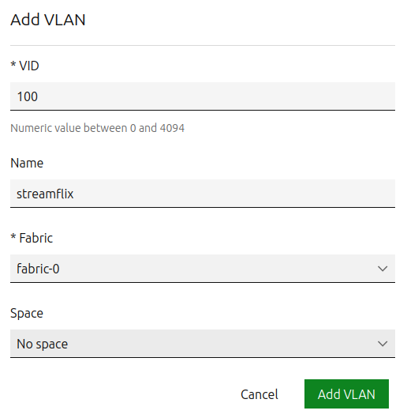

# PRÁCTICA 2_2

## Distribución de los equipos
Los equipos se han distribuido y organizado de la siguiente forma, donde cada equipo cuenta con VMs para diferentes roles, incluyendo clientes, nodos de Kubernetes y workers:


| ID       | Num. Red | Posición     | VMs                                      |  Dirección IP                          |
|----------|----------|--------------|------------------------------------------|----------------------------------------|
|  U110246 | Z1       | Fila 1 – 6   | Client1                                  |  192.168.1.31                           |
|  U110245 | Z2       | Fila 1 – 5   | Client2                                  |  192.168.1.32                           |
|  U110244 | Z3       | Fila 1 – 4   | Client3                                  |  192.168.1.33                           |
|  U110243 | Z4       | Fila 1 – 3   | MaaS, Juju                               |  192.168.1.10             |
|  U110242 | Z33      | Fila 1 – 2   | K8s_easyrsa, K8s_etcd, K8s_control_plane |  192.168.1.21 |
|  U110241 | Z31      | Fila 1 - 1   | VWorker1                                 |  192.168.1.13                          |
|  U110253 | Z37      | Fila 3 – 1   | VWorker2                                 |  192.168.1.11                          |
|  U110254 | Z39      | Fila 3 – 2   | VWorker3                                 |  192.168.1.14                          |
|  U110255 | Z16      | Fila 3 – 3   | VWorker4                                 |  192.168.1.12                          |
|  U110256 | Z15      | Fila 3 – 4   | VWorker5                                 |  192.168.1.18                          |
|  U110257 | Z14      | Fila 3 – 5   | VWorker6                                 |  192.168.1.22                          |
|  U110258 | Z13      | Fila 3 - 6   | VWorker7                                 |  192.168.1.19                          |

Para configurar la red interna (en nuestro caso, la 192.168.1.0/24), es decir, las direcciones IP de los clienets y del servidor MaaS en Kubuntu. Para ello, hemos ido a ***Network / Connections*** y hemos seleccionado la ***Wired Ethernet 2*** a configurar:

- Hemos cambiado el ***method*** a *manual*.

- Hemos añadido los servidores DNS de la universidad: 
    ```bash
    10.10.13.107
    10.10.13.108
    ```

- Hemos añadido el address, netmask y gateway:
    - **Address:** 192.168.1.1
    - **Netmask:** 255.255.255.0
    - **Gateway:** 192.168.1.10 (*Dirección IP del MaaS controller*)

## Características de las VM
Cada VM tiene las siguientes configuraciones específicas de CPU, RAM y disco duro:

| VM                    | Num. CPU | RAM  | Disco |Nombre MaaS|
|-----------------------|----------|------|-------|-----------|
| Client 1              | 2        | 8 GB | 50 GB ||
| Client 2              | 2        | 8 GB | 50 GB ||
| Client 3              | 2        | 8 GB | 50 GB ||
| MaaS                  | 2        | 8 GB | 50 GB ||
| Juju                  | 2        | 8 GB | 50 GB |subte-maggot|
| K8s_easyrsa           | 1        | 4 GB | 30 GB |ruling-newt|
| K8s_etcd              | 2        | 4 GB | 30 GB |caring-osprey|
| K8s_control_plane     | 2        | 4 GB | 30 GB |rare-ant|
| VWorker1              | 2        | 8 GB | 30 GB |crack-cicada|
| VWorker2              | 2        | 8 GB | 30 GB |clear-goat|
| VWorker3              | 2        | 8 GB | 30 GB |equal-horse|
| VWorker4              | 2        | 8 GB | 30 GB |super-wasp|
| VWorker5              | 2        | 8 GB | 30 GB |gentle-dory|
| VWorker6              | 2        | 8 GB | 30 GB |game-kiwi|
| VWorker7              | 2        | 8 GB | 50 GB |big-mantis|

## Metal as a Service (MaaS)
MaaS es una solución de administración de infraestructura física que convierte servidores físicos en recursos virtualizados fáciles de gestionar y usar. MaaS permite a los administradores del sistema y desarrolladore tratar servidores físicos de la misma manera que se tratan las VM en la nube, proporcionando una plataforma automatizada para la implementación y gestión de hardware. Este concepto introducido por Canonical nos permite tener una serie de beneficios al usarlo:

- **Eficiencia**: Automatiza tareas repetitivas y complejas de despliegue de hardware, ahorrando tiempo y reduciendo errores humanos.

- **Escalabilidad**: Facilita el escalado horizontal al permitir la rápida implementación de nuevos servidores físicos según sea necesario.

- **Flexibilidad**: Soporta múltiples sistemas operativos y configuraciones de hardware, adaptándores a diversas necesidades empresariales y de desarrollo.

- **Visibilidad y control**: Proporciona una vista unificada de todos los recursos físicos disponibles y su estado, mejorando la gestión y utilización de los activos de hardware.

### 1. Instalación MaaS
En una de las máquinas virtuales, hemos instalado el MaaS controller. Para ello, hemos seguido el siguiente [*tutorial oficial de instalación de MaaS*](https://maas.io/docs/how-to-install-maas).

#### Paso 1: Instalación de MAAS desde paquetes
La versión que hemos instalado es la 3.4:

```bash
sudo apt-add-repository ppa:maas/3.4
sudo apt update
sudo apt-get -y install maas
```

Después de la instalación, hemos realizado la configuración para un entorno de producción.

#### Paso 2: Desabilitar ```systemd-timesyncd```
Hemos deshabilitado el servicio de sincronización de tiempo de **systemd**.
```bash
sudo systemctl disable --now systemd-timesyncd
```

#### Paso 3: Instalación de PostgreSQL
Hemos instalado PostgreSQL para gestionar la base de datos de MaaS:
```bash
sudo apt install -y postgresql
```

#### Paso 4: Configuración de la base de datos y del usuario
A continuación, hemos configurado el usuario y la base de datos en PostgreSQL:
```bash
export DBUSER="user1"   # Para crear la variable de entorno del nombre de usuario
export DBPASS="1234"    # Para crear la variable de entorno de la contraseña
sudo -i -u postgres psql -c "CREATE USER \"$DBUSER\" WITH ENCRYPTED PASSWORD '$DBPASS'"

export DBNAME="dbname"  # Para crear la variable de entorno del nombre de la base de datos
sudo -i -u postgres createdb -O "$DBUSER" "$DBNAME"
```

#### Paso 5: Configuración del archivo ```pg_hba.conf```
Hemos editado el fichero de configuración de PostgreSQL para definir el acceso a la base de datos. Para ello, hemos modificado el fichero ***pg_hba.conf***:
```bash
sudo nano /etc/postgresql/14/main/pg_hba.conf
```

Luego, hemos añadido la siguiente línea al final del fichero para permitir el acceso al usuario:
```bash
host    dbname    user1    0/0     md5
```

### 2. Inicialización del MaaS
Para inicializar MaaS, hemos utilizado el siguiente comando (ya que el del tutorial no nos funcionaba debido a la versión utilizada):
```bash
sudo maas init
```

Durante la configuración de la autenticación:
- **URL del servicio Canonical RBAC:** Lo hemos dejado en blanco, ya que no utilizamos este servicio.

- **Ruta del archivo de agente de autenticación Candid:** Lo hemos dejado también, ya que tampoco lo utilizamos.

- Hemos creado el usuario administrador con los siguientes datos:
    - Username: ***admin***
    - Password: ***maas***
    - Email: ***admin@maas.com***

- **Import claves SSH [] (lp:user-id or gh:user-id):** Lo hemos dejamos en blanco también, ya que la clave pública SSH la metemos más adelante.

Para acceder a la interfaz gráfica desde el navegador:
- **En el equipo local:** http://localhost:5240/MAAS/r/intro

- **En el equipo remoto:** http://direccionIP:5240/MAAS/r/intro

### 3. Configuración del MaaS controller desde la GUI
Para acceder al MaaS controller, hemos abierto la siguiente URL en el navegador: http://192.168.1.10:5240/MAAS/r/intro

Desde esta interfaz gráfica se ha realizado todas las configuraciones necesarias para el funcionamiento del MaaS controller. A continuación, se explica cada configuración realizada:

#### Paso 1: Iniciar sesión con el usuario administrador
Hemos iniciado sesión con el usuario administrador que hemos creado previamente. Para ello, hemos introducido los siguientes datos:
- **Username:** *admin*
- **Password:** *maas*


#### Paso 2: Configurar la conectividad del MaaS controller
Una vez dentro, hemos configurado la conectividad del MaaS controller. Para ello, hemos añadido los servidores DNS de la universidad (***10.10.13.107*** y ***10.10.13.108***) y lo demás lo hemos dejado como estaba por defecto:


#### Paso 3: Instalación de la versión de Ubuntu (22.04 LTS amd64)
Después, hemos seleccionado la imagen a importar (**22.04 LTS**) y la arquitectura (**amd64**), la cual estará disponible para su despliegue en máquinas gestionadas por el MaaS controller.


#### Paso 4: Generación y configuración de la clave SSH
Hemos generado una clave SSH y la hemos añadido al usuario de MaaS con el siguiente comando:
```bash
ssh-keygen -t rsa -b 4096 -C "admin@maas.com"
```

Este comando nos ha solicitado una contraseña o passphrase (***12345678***) para la clave privada, aumentando la seguridad. De esta forma, se han generado una clave pública y una privada en el siguiente directorio:
```bash
~/.ssh/id_rsa       # Clave privada
~/.ssh/id_rsa.pub   # Clave pública
```

Luego, hemos importado la clave pública en el MaaS controller a través de la interfaz del usuario.


#### Paso 5: Habilitar DHCP
Hemos habilitado el DHCP, que por defecto está deshabilitado, de la siguiente manera:

- Primero, hemos ido a la sección de **Subnets** y hemos creado una nueva **VLAN** llamada "***streamflix***" de VID igual a 100.

    

- Luego, hemos creado una nueva **subnet** llamada ***"subnet1"*** con el siguiente CIDR: **192.168.1.0/24** y los siguientes campos:

    

- Por último, hemos configurado el DHCP para habilitarlo de la siguiente manera:

    

#### Paso 6: Habilitar DNS
Asimismo, hemos habilitado el DNS del MaaS en la red local, que por defecto está deshabilitado.

En este caso, no hemos podido utilizar los servidores DNS de Google (8.8.8.8 o 8.8.4.4) debido a que la UPV/EHU los bloquea. Para ello, hemos tenido que utilizar los servidores DNS de la universidad que se han obtenido como se explicó en la práctica anterior (***Práctica2_1***) y son los siguientes:
```bash
10.10.13.107
10.10.13.108
```

De esta forma, hemos habilitado el DNS:


#### Paso 7: Deshabilitar DNSSEC
Para deshabilitar el DNSSEC del MaaS hemos ido a Settings, Network/DNS y hemos deshabilitado la opción de DNSSEC de la siguiente manera:


#### Paso 8: Habilitar NAT
Por último, hemos habilitado NAT para rutar peticiones al exterior a través del MaaS controller. Para configurar la VM del MaaS controller para que haga NAT solo hemos tenido que cambiar un par de cosas:

1. **Habilitación del IP Forwarding:** Hemos editado el fichero de configuración ***sysctl.conf*** para permitir el reenvío de IP con el siguiente comando:
    ```bash
    sudo nano /etc/sysctl.conf
    ```

    Hemos descomentado la siguiente línea del fichero:
    ```bash
    net.ipv4.ip_forward=1
    ```

    Y después hemos aplicado los cambios:
    ```bash
    sudo sysctl -p
    ```

2. **Configuración de IPTables para NAT:** Hemos configurado IPTables para realizar NAT, ejecutando el siguiente comando:
    ```bash
    sudo iptables -t nat -A POSTROUTING -o enp0s3 -j MASQUERADE
    ```

## Prueba de conectividad entre los equipos
Hemos realizado una prueba de conectividad previa entre los equipos de nuestra propia red. Para esta primera prueba, todavía no se han configurado las direcciones IP de la tabla anterior. Estas direcciones IP han sido obtenidas de forma dinámica con el protocolo DHCP. Para esta prueba de conectividad se realizado un ping entre los distintos equipos para verificar la conectividad entre todos ellos:

| Equipo host | Dirección IP       |
|-------------|--------------------|
| Client1     | 169.254.20.178     |
| Client2     | 169.254.91.148     |
| Client3     | 169.254.29.200     |
| MaaS        | 169.254.91.29      |
| Kubernetes  | 169.254.230.138    |
| VWorker1    | 169.254.216.76     |
| VWorker2    | 169.254.13.0       |
| VWorker3    | 169.254.118.155    |
| VWorker4    | 169.254.101.233    |
| VWorker5    | 169.254.232.175    |
| VWorker6    | 169.254.228.182    |
| VWorker7    | 169.254.91.200     |

## Configuración de nodos PXE:
1. **Configuración de arranque por red (PXE) en las máquinas virtuales:**

Primero, hemos configurado todas las máquinas virtuales (VMs) para que inicien a través del arranque por red (PXE) y hemos desactivado cualquier otro tipo de arranque, asegurando que todas las VMs puedan ser gestionadas correctamente desde el MaaS controller.

2. **Descarga del script del repositorio vboxpower:**

Hemos descargado el script de Python [*vboxpower.py*](https://github.com/ssbostan/vboxpower/blob/master/vboxpower.py) en los equipos host que gestionan las VMs, permitiendo el control remoto de encendido y apagado.

3. **Ejecución del script de Python:**

Para habilitar el arranque y apagado remoto de las máquinas virtuales, hemos ejecutado el script ***vboxpower.py*** en todos los equipos host que tienen una o más VMs a ser arrancadas desde el MaaS controller:
```bash
python vboxpower.py
```

4. **Arranque de las máquinas virtuales:**

Luego, hemos arrancado todas las VMs para que el MaaS controller pueda detectarlas y comenzar su proceso de comisionamiento.

5. **Deshabilitación de reglas de firewall relacionadas con Python:**

Para evitar problemas de conexión, hemos eliminado dos reglas de firewall en el equipo host relacionadas con Python que estaban interfiriendo en el correcto funcionamiento del script.

6. **Configurar las llamadas curl:**

Con las máquinas virtuales encendidas, hemos verificado su estado mediante una llamada curl a la dirección IP de cada equipo:
```bash
curl 192.168.1.26:5241 # Reemplazar con la IP correspondiente de cada equipo
```

Ejemplo de salida:
```bash
{
  "machines": [
    {
      "links": {
        "off": "/VWorker1/off",
        "on": "/VWorker1/on",
        "status": "/VWorker1/status"
      },
      "name": "VWorker1",
      "status": "running"
    },
    {
      "links": {
        "off": "/maas/off",
        "on": "/maas/on",
        "status": "/maas/status"
      },
      "name": "maas",
      "status": "running"
    }
  ]
}
```

7. **Configuración de webhooks en MaaS:**

En el MaaS controller, hemos configurado los webhooks necesarios para que el sistema pueda gestionar el encendido y apagado automático de las VMs. Primero, hemos asignado etiquetas (tags) a cada grupo de máquinas de la siguiente manera:

- **K8s_easyrsa:** K8s_easyrsa

- **K8s_etcd:** K8s_etcd

- **K8s_control_plane:** K8s_control_plane

- **Worker:** VWorker1, VWorker2, VWorker3, VWorker4, VWorker5, VWorker6, VWorker7

Posteriormente, hemos configurado las siguientes URLs para cada VM:

- http://**[ip]**:5241/**[VM_Name]**/status

- http://**[ip]**:5241/**[VM_Name]**/on

- http://**[ip]**:5241/**[VM_Name]**/off

Estas URLs permiten a MaaS conocer el estado de cada VM y gestionar su encendido y apagado.

8. **Acceso por SSH a los nodos:**

Una vez configurados los nodos, hemos accedido a uno de ellos por SSH con el siguiente comando:
```bash
ssh ubuntu@[ip]
```

A continuación, se muestra una captura del acceso por SSH:


9. **Comprobación de espacio en disco, uso de CPU y uso de RAM:**

Finalmente, hemos comprobado el estado de uno de los nodos para verificar su rendimiento y capacidad, revisando el espacio en disco, el uso de CPU y el uso de memoria RAM:

- **Uso de CPU y memoria RAM:** Hemos utilizado el siguiente comando para monitorizar el uso de CPU y memoria RAM:
  ```bash
  htop
  ```

  A continuación, se muestra la salida obtenida:

  

- **Espacio en disco:** Para verificar el uso y la disponibilidad de las particiones de almacenamiento, hemos utilizado este comando:
  ```bash
  df -h
  ```

  El resultado se muestra en la siguiente captura:
  
  

## Ciclo de vida del nodo


### **1. ENLISTMENT/NEW**

En esta fase inicial, el nodo es detectado por el sistema de gestión. Este proceso se lleva a cabo automáticamente cuando la máquina se arranca por primera vez en modo PXE, momento en el que se comunica con el servidor MaaS. Durante esta fase:

- El nodo envía información básica de hardware (como ***CPU, RAM, y disco***) al MaaS.

- MaaS registra el nodo en su base de datos, marcándolo como ***NEW***.

- Es responsabilidad del administrador decidir si el nodo será aceptado para pasar a las siguientes fases.

En nuestra práctica, hemos detectado las máquinas virtuales configuradas y las hemos añadido al sistema, lo que ha permitido que estas sean reconocidas y marcadas como disponibles para la siguiente fase.

### **2. COMMISSIONING**
En esta fase, el nodo se evalúa y configura mínimamente para verificar que cumple los requisitos necesarios para su uso. El proceso incluye:

- Arranque con un sistema operativo ligero en modo ***read-only*** (normalmente a través de HTTP).

- Ejecución de scripts de inventario para identificar el hardware disponible (CPU, RAM, discos, etc.).

- Realización de pruebas de hardware para asegurarse de que todos los componentes funcionan correctamente.

- Actualización del firmware si es necesario. 

Esta fase puede ser relativamente prolongada debido a la cantidad de verificaciones y configuraciones realizadas.

### **3. READY**
Una vez completada la fase anterior, el nodo está completamente identificado, probado y listo para asignarse a un usuario o proceso. En este estado:

- Se configuran credenciales necesarias para el acceso remoto, como las de la interfaz de gestión del nodo (***Baseboard Management Controller*** o ***BMC***).

- La gestión remota del nodo se realiza mediante protocolos como ***IPMI*** (***Intelligent Platform Management Interface***).

- El nodo queda disponible en el ***pool*** de recursos para ser asignado.

En nuestra práctica, este es el estado en el que hemos dejado las máquinas virtuales preparadas. Sin embargo, hemos probado con una máquina virtual para que pasase por todos los estados.

### **4. ALLOCATED**
En esta fase, el nodo se asigna a un usuario o equipo para que comience a personalizarlo según sus necesidades. Las actividades típicas incluyen:

- Configuración de la red (direcciones IP, interfaces, etc.).

- Creación de particiones o volúmenes en los discos.

- Instalación inicial de aplicaciones o servicios básicos según los requerimientos.

### **5. DEPLOYING/DEPLOYED**
En esta fase, el nodo se configura completamente para su propósito final. 

- Durante el estado de ***Deploying***, se instala un sistema operativo completo en el nodo, en nuestro caso ***Ubuntu 22.04***.  

- Una vez completado este proceso, el nodo pasa al estado ***Deployed***, quedando completamente operativo y listo para su uso.

En este estado, el nodo está funcional y preparado para las tareas asignadas, como producción o pruebas.

### **6. RELEASING**
En la fase final, el nodo se libera para su reutilización o retiro. Este proceso puede incluir:

- Borrado seguro del disco para garantizar la protección de los datos previos.

- Preparación del nodo para volver a un estado anterior, como ***Ready*** o ***New***, dependiendo de si será reutilizado o retirado.