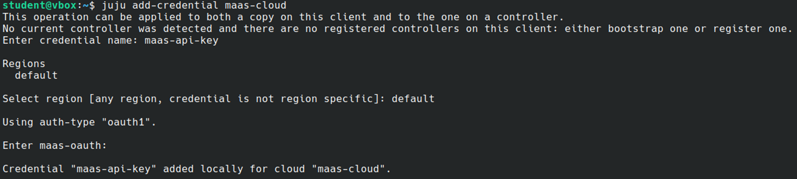

# PRÁCTICA 3_1

## Juju
Juju es una herramienta de código abierto desarrollada por Canonical, conocida por ser la empresa detrás de Ubuntu. Está diseñada para facilitar la implementación, gestión y escalado de aplicaciones, ya sea en la nube o en entornos locales. Su modelo de administración basado en aplicaciones permite automatizar tareas y orquestar servicios de forma eficiente, lo que resulta importante en nuestro caso práctico.

En este informe vamos a detallar los pasos que hemos segurido para utilizar Juju en conjunto con MaaS, destacando los comandos y las configuraciones realizadas:

### 1. Instalación del cliente de Juju
El cliente de Juju lo hemos instalado en 3 equipos diferentes, concretamente en los 3 clientes que tenemos disponibles, mediante el siguiente comando:
```bash
sudo snap install juju --classic
```

Existen algunos comandos útiles para obtener información sobre Juju:
```bash
juju help           # Visión general de los comandos disponibles
juju help commands  # Lista detallada de funcionalidades y comandos
```

### 2. Configuración de la nube MaaS en Juju
Para integrar Juju con MaaS, es necesario añadir la nube y sus credenciales. Este proceso lo hemos realizado de la siguiente manera:

- **Creación del fichero YAML:** 

Este fichero define la configuración de la nube, incluyendo la dirección IP del controlador de MaaS, que en nuestro caso es la `192.168.1.10`. El contenido del fichero es el siguiente:
```bash
clouds:
maas-cloud:
    type: maas
    auth-types: [oauth1]
    endpoint: http://192.168.1.10:5240/MAAS
```

> [!IMPORTANT]
> Es importante modificar el fichero YAML y especificar la dirección IP del controlador de MaaS.

- **Añadir la nube en Juju:**

Una vez hemos configurado el fichero YAML, hemos ejecutado el siguiente comando para añadir la nube en Juju:
```bash
juju add-cloud maas-cloud maas-cloud.yaml
```

- **Añadir credenciales:**

Después, hemos añadido las credenciales asociadas para autenticar la conexión con el siguiente comando:

```bash
juju add-credential maas-cloud
```

Durante este proceso, nos ha solicitado la siguiente introducir la **región**, que se ha especificado como `default` y la API Key del MaaS, que se ha obtenido desde el controlador de MaaS.



- **Verificación:**

Por último, hemos verificado las nubes y credenciales configuradas con los siguientes comandos:
```bash
juju clouds
juju credentials
```

### 3. Creación del controlador
El controlador es la instancia principal que gestiona aplicaciones y máquinas en MaaS y lo hemos creado con el siguiente comando, especificando la etiqueta juju para seleccionar la máquina adecuada:
```bash
juju bootstrap maas-cloud --bootstrap-constraints "tags=juju"
```

Para añadir un nuevo modelo llamado ***my-model*** (espacio lógico para aplicaciones y máquinas), hemos utilizado el siguiente comando:
```bash
juju add-model my-model
```

Comandos útiles para verificar el estado del controlador y sus recursos:
```bash
juju status        # Estado general del controlador y sus recursos
juju controllers   # Lista de controladores
juju machines      # Información sobre las máquinas gestionadas
juju models        # Modelos existentes en el controlador
```

### 4. Solicitud de máquinas al MaaS y despliegue de Ubuntu 22.04
Para asignar máquinas en estado ***ready*** en MaaS, se pueden utilizar uno de los siguientes comandos:

- **Solicitar una máquina de forma aleatoria:**
```bash
juju add-machine
```

- **Solicitar una máquina con restricciones específicas:**
Por ejemplo, seleccionar una máquina con la etiqueta ***Worker***:
```bash
juju add-machine --constraints "tags=Worker"
```

En nuestro caso, hemos utilizado el segundo comando para garantizar la selección de una máquina específica.

### 5. Conexión por SSH a las maquinas desde Juju
Una vez asignada una máquina, es posible conectarse a ella mediante SSH con el siguiente comando:
```bash
juju ssh <machine-id>
```

En este comando, hay que especificar el número de la máquina a la que conectarse. Ejemplo:
```bash
juju ssh 1
```

### 6. Liberación de máquinas al MaaS
Para devolver una máquina al estado ***ready***, hemos tenido que ejecutar el siguiente comando:
```bash
juju remove-machine <machine-id>
```

De la misma forma que antes, hay que especificar el número de la máquina a liberar. Ejemplo:
```bash
juju remove-machine 1
```

### 7. Despliegue del dashboard de Juju
El **dashboard de Juju** permite gestionar la infraestructura a través de una interfaz gráfica. Los pasos para desplegarlo son los siguientes, aunque en nuestro caso no hemos llegado a desplegarlo:

- Cambiar al modelo del controlador:
```bash
juju switch controller
```

- Desplegar y configurar el dashboard:
```bash
juju deploy juju-dashboard
juju integrate juju-dashboard controller
juju expose juju-dashboard
```

- Acceder al dashboard:
```bash
juju dashboard
```

> [!NOTE]
> El proxy de conexión es accesible en http://localhost:31666.

## Compartición del controlador con otros clientes Juju
El controlador de Juju puede compartirse también con otros clientes, aunque este paso no ha sido implementado hasta el momento. De todas formas, estos serían los pasos a seguir:

#### **Paso 1: Crear una cuenta de usuario en el controlador Juju**
En primer lugar, es necesario añadir un nuevo usuario al controlador desde el cliente principal (el que creó el controlador). Para ello, hay que ejecutar:
```bash
juju add-user <nombre-usuario>
```

Por ejemplo, para añadir un usuario llamado ***client1***:
```bash
juju add-user client1
```

Este comando genera un enlace de invitación que debe compartirse con el cliente correspondiente para que pueda autenticarse.

#### **Paso 2: Compartir el enlace de invitación**
El enlace de invitación se envía al cliente que desea acceder al controlador. Este enlace tiene el siguiente formato:
```bash
juju register <token-de-invitación>
```

El cliente receptor debe ejecutar el comando proporcionado para registrarse en el controlador. Por ejemplo:
```bash
juju register "eyJhbGciOiJIUzI1NiIsInR...resto-del-token"
```

#### **Paso 3: Verificar los usuarios registrados**
Desde el cliente principal, es posible listar todos los usuarios registrados en el controlador con el siguiente comando:
```bash
juju users
```

Esto muestra una lista de usuarios activos y sus permisos.

#### **Paso 4: Asignar permisos al usuario**
Por defecto, el nuevo usuario puede no tener permisos completos sobre el controlador. Para asignar permisos de acceso, utilizamos:
```bash
juju grant <nombre-usuario> <permiso>
```

**Ejemplo:** Otorgar al usuario ***client1*** permisos de administración sobre un modelo específico:
```bash
juju grant client1 admin my-model
```

También es posible otorgar acceso global al controlador si se requiere:
```bash
juju grant client1 superuser
```

#### **Paso 5: Acceso al controlador desde otros clientes**
Una vez que el cliente ha ejecutado el comando juju register con el token de invitación y se han configurado los permisos, puede listar los controladores disponibles con:
```bash
juju controllers
```

Para trabajar con el controlador compartido, debe seleccionarlo con:
```bash
juju switch <nombre-controlador>
```

Ejemplo:
```bash
juju switch maas-cloud
```

#### **Paso 6: Verificar el estado del controlador y modelos**
Desde el cliente conectado, es posible comprobar el estado del controlador y los modelos gestionados con los siguientes comandos:
```bash
juju status                 # Estado general del controlador y modelos
juju models                 # Lista de modelos disponibles
juju show-model <modelo>    # Detalles de un modelo específico
```

## Exportación de la clave privada SSH
Asimismo, hemos exportado nuestra clave privada `id_rsa` a las máquinas de los clientes para permitir el acceso remoto seguro a las máquinas gestionadas por Juju. Aunque en realidad, luego no ha sido necesario utilizarla, ya que sin ella también puedes acceder a las máquinas. Sin embargo, hemos evitado que salga el aviso relacionado con el directorio SSH no creado `/home/student/.ssh`. Para ello, hemos realizado los siguiente pasos:

- Crear el directorio SSH en las máquinas cliente:
```bash
mkdir -p /home/student/.ssh
```

- Copiar la clave privada [***id_rsa***](id_rsa) al directorio creado.

## Conclusión
El uso de Juju simplifica considerablemente la gestión de infraestructuras, permitiendo automatizar tareas complejas. Su integración con MaaS nos ha permitido desplegar y gestionar máquinas fácilmente.

El uso de Juju combinado con MaaS ha simplificado significativamente la gestión de infraestructuras, permitiendo:

- Automatizar tareas complejas, como la provisión de máquinas y el despliegue de aplicaciones.

- Reducir el tiempo necesario para configurar y orquestar servicios.

Gracias a su enfoque basado en modelos, Juju se presenta como una solución eficiente para entornos locales y en la nube, mejorando la productividad y escalabilidad en la administración de recursos.

## Referencias

- [Instalación y configuración Juju](https://github.com/antongisli/maas-baremetal-k8s-tutorial/tree/main)

- [Gestión de usuarios Juju](https://juju.is/docs/juju/manage-users)