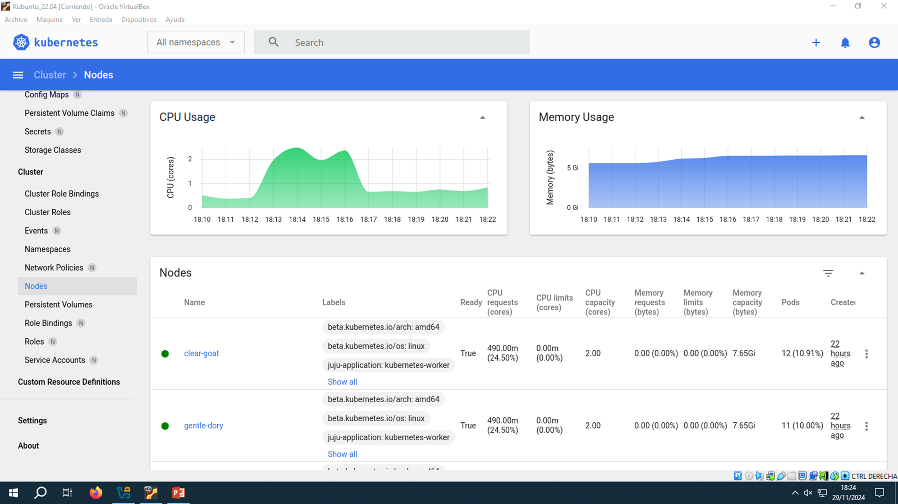

# PRÁCTICA 3_2

El objetivo de esta práctica es instalar un clúster Kubernetes production-grade con Juju, gestionar aplicaciones con Helm y configurar un sistema de almacenamiento distribuido con Longhorn.

## Kubernetes
### Charmed Kubernetes
Instalación sencilla de un cluster Kubernetes production-grade con Juju:
1. Crear un modelo en Juju para Kubernetes:
```bash
juju add-model k8s maas-cloud
```

2. Desplegar Charmed Kubernetes usando un fichero de configuración (`k8s-overlay.yaml`):
```bash
juju deploy charmed-kubernetes --overlay k8s-overlay.yaml
```

### Escalado horizontal
Para aumentar o reducir la capacidad del clúster:
- Añadir un nuevo nodo:
```bash
juju add-unit kubernetes-worker
```

- Añadir un nodo en una máquina específica:
```bash
juju add-machine
juju add-unit kubernetes-worker --to <machine-id>
```

- Eliminar un nodo existente:
```bash
juju remove-unit kubernetes-worker/<unit-id>
```

### Configuración de kubectl
Configurar el acceso al clúster con ***kubectl***:
- Instalar ***kubectl*** y verificar la versión:
```bash
sudo snap install kubectl --classic
kubectl version
```

- Obtener el fichero de configuración:
```bash
mkdir ~/.kube
juju ssh kubernetes-control-plane/1 -- cat config > ~/.kube/config
```

### Acesso al dashboard de Kubernetes
Habilitar el acceso al dashboard web:
```bash
kubectl port-forward service/kubernetes-dashboard -n kubernetes-dashboard 8443:443
```

Acceder desde un navegador: ***https://localhost:8443***.





### Añadir Kubernetes como cloud en Juju
Configurar Kubernetes como un cloud para gestionar despliegues:
```bash
juju add-k8s k8s-cloud
juju bootstrap k8s-cloud
```

## Helm
### Instalar Helm
```bash
sudo snap install helm --classic
```

### Repositorios de charts
Helm es un gestor de paquetes (charts) para Kubernetes.

- Añadir un repositorio:
```bash
helm repo add <name> <url>
helm repo update
```

- Buscar charts en un repositorio:
```bash
helm search repo <name>  # vs helm search hub
```

### Gestión de releases
Un *chart* puede instalarse múltiples veces como una *release*:
- Instalar una release:
```bash
helm install <release-name> <repo/chart>
```

O generar un nombre automáticamente:
```bash
helm install <repo/chart> --generate-name
```
- Consultar estado de una release:
```bash
helm status <release-name>
helm list
```

- Desinstalar una release:
```bash
helm uninstall <release-name>
```

### Ayuda
Consultar comandos y opciones de Helm:
```bash
helm help 
helm <comando> -h
```

## Longhorn
### Recomendaciones HW:
- 3 nodos

- 4 vCPUs y 4 GiB RAM por nodo

- Almacenamineto SSD

### Instalación con Helm
1. Añadir el repositorio de Longhorn:
```bash
helm repo add longhorn https://charts.longhorn.io
helm repo update
```

2. Instalar Longhorn:
```bash
helm install longhorn longhorn/longhorn --namespace longhorn-system --create-namespace --version 1.6.2
```

3. Acceder a la interfaz de Longhorn:
```bash
kubectl port-forward service/longhorn-frontend -n longhorn-system 8001:80
```

Acceder desde un navegador: ***http://localhost:8001***


## Problemas y pruebas realizadas
Durante la práctica, hemos tenido problemas a la hora de arrancar el Juju controller, ya que al iniciar la MV de este, el MaaS controller le asignaba una dirección IP dentro del rango de direcciones configurado (192.168.1.3, concretamente), pero luego en el paso de TFTP el Juju controller realizaba un TFTP Request al MaaS controller, pero este último no respondía, provocando un error ***PXE-E32: TFTP open timeout***.

Para ver de donde podía venir el fallo, hemos revisado lo siguiente:

1. **Configuración del NAT:**

Hemos comprobado que la configuración del NAT estuviese bien configurada. 

- Hemos asegurado que la línea `net.ipv4.ip_forward=1` en el fichero `/etc/sysctl.conf` estuviera descomentada.

- Hemos aplicado el comando `sudo iptables -t nat -A POSTROUTING -o enp0s3 -j MASQUERADE` (recordando que esta configuración no es persistente tras un reinicio).

- Hemos probado la conectividad desde distintos equipos de la red, verificando la comunicación tanto entre máquinas como acceso a Internet.

2. **Estado del firewall:**

Hemos comprobado que el firewall estuviese desactivado. Para ello, primero hemos comprobado si el firewall estaba desactivado con (***sudo ufw status***) y en caso de no estar desactivado, hay que ejecutar (***sudo ufw disable***). De esta forma, nos aseguramos que el firewall, esté desactivado.

3. **Configuración de los switches:**

Hemos probado en dos switches diferentes (***switch2*** y ***switch3***) para ver si el problema podía estar ahí y al cambiar de switch ya no saltaba el TFTP timeout, pero aún así no terminaba de cargar del todo el Juju controller. Hemos mirado también la configuración de los swicthes con el siguiente comando:

```bash
ssh switch2@u017633.ehu.es
Password: switch2-xx

ssh switch3@u017633.ehu.es
Password: switch3-xx
```

4. **Estado del MaaS Controller:**

Hemos verificado el estado del MaaS controller con el siguiente comando, para asegurarnos de que servicios como ***maas-regiond*** y ***maas-rackd*** estuvieran activos.
```bash
sudo maas status
```

Hemos probado también a reiniciarlos con los siguientes comandos:
```bash
sudo systemctl restart maas-regiond
sudo systemctl restart maas-rackd
```

De esta forma, no hemos conseguido solucionar nada.

5. **Prueba del servidor TFTP:**

También hemos probado el funcionamiento del servidor TFTP manualmente desde uno de los clientes:

- Hemos instlado el cliente TFTP (`sudo apt install tftp-hpa`) y hemos comprobado el estado del servicio con `sudo systemctl status tftpd-hpa`.

- Después, hemos probado a transferir un fichero básico (pxelinux.0) al cliente de la siguiente manera:
```bash
tftp 192.168.1.10
tftp> get pxelinux.0
```

De esta forma, nos ha saltado un error de "***pxelinux.0: Permission denied***". Esto se supone que es por temas de permisos del fichero `pxelinux.0`, por lo que habría que mirar que permisos tiene configurados.

Para ver los logs, hemos utilizado el siguiente comando:
```bash
sudo journalctl -u tftpd-hpa
```

6. **Problemas adicionales al desplegar un Worker:**

Al final, hemos probado a desplegar otro equipo diferente (un ***Worker***) y hemos tenido problemas, ya que no nos dejaba realizar el deploy ya tampoco. El MaaS controller mediante DHCP le asignaba un dirección IP (192.168.1.38) al Worker, pero luego esa dirección que tendría que aparecer en el dashboard del MaaS controller, no aparecía.

7. **Problema con el DHCP y las IPs duplicadas**

Al final, hemos detectado que el servidor DHCP ha asigando una dirección IP ya configurada manualmente en uno de los clientes (192.168.1.3). Esto causaba un error TFTP al intentar comunicarse, ya que había dos equipos con la misma dirección IP.

Para solucionarlo, hemos cambiado la dirección IP del cliente afectado para resolver el conflicto. Ahora el ***juju*** funciona correctamente.

> [!NOTE]
> Tenemos que revisar la configuración de las direcciones IP reservadas del DHCP, ya que no están siendo respetadas. Para solucionarlo, vamos a asignar estáticamente a los clientes las direcciones 192.168.1.201-202-203 y vamos a excluir estas direcciones en el Maas Controller.

Hemos comprobado en el switch que no hubiese configurado un servidor DHCP que nos estuviese dando problemas, pero hemos verificado que no hay un servidor DHCP configurado en el switch.

Para ello, hemos realizado el siguiente análisis en el switch (***switch3***):

- **Lista de direcciones IP asignadas vacía:**
El comando `show ip dhcp binding` vacío indica que no se han asignado direcciones IP desde el switch.


- **Sin conflictos DHCP:** El comando `show ip dhcp conflict` sin datos confirma que no ha habido conflictos, lo cual es esperado si el switch no está actuando como servidor DHCP.


- **Estadísticas del servidor DHCP:** El comando `show ip dhcp server statistics` muestra que el servidor DHCP está inactivo.


```bash
Address pools: 0 # No hay pools configurados.
Message Sent/Received: 0 # No ha habido tráfico DHCP gestionado por el switch.
```

- **DHCP Snooping deshabilitado:** El comando `show ip dhcp snooping` muestra que el switch no está inspeccionando solicitudes DHCP en la red, lo cual tampoco interfiere.


8. **Configuración de clientes en *juju***

Hemos configuramos el cliente ***juju*** en otros dos equipos, en los clientes que faltaban (***client1*** y ***client2***). Por lo tanto, desde cliente (***client3***) que creamos el controlador hemos generado un token para realizar la configuración explicada en la [***Practica3_1***](..\Practica3_1\Practica3_1.md). A los dos clientes les hemos dado permisos de ***admin*** y ***superuser***.

9. **Instalación del cluster Kubernetes production-grade con Juju:**

Durante la instalación del clúster Kubernetes production-grade con Juju, hemos tenido un problema relacionado con los permisos del fichero `k8s-overlay.yaml`. Este fichero lo habíamos creado utilizando *sudo*, lo que había asignado permisos de ***root*** en lugar de ***student***, el usuario requerido. Como resultado, al ejecutar el siguiente comando, se generaba un error indicando que no se podía encontrar el fichero:
```bash
juju deploy charmed-kubernetes --overlay k8s-overlay.yaml
```

Para solucionarlo, hemos cambiado los permisos de ***root*** a ***student*** haciendo uso del siguiente comando:
```bash
sudo chown student:student k8s-overlay.yaml
```

10. **Conexión SSH y manejo de claves:**

Al realizar una conexión SSH desde las equipos clientes hemos detectado que no funcionaba aun teniendo la clave privada SSH en cada uno de los clientes. El problema estaba que al copiar y pegar el contenido del `id_rsa` no se había copiado correctamente. 

Para solucionarlo, hemos exportado la clave privada y la hemos compartido de forma segura (por correo electrónico en lugar de usar el repositorio). Asimismo, hemos tenido que realizar una configuración adicional para que funcionase. Hemos tenido que cambiar los permisos de la clave privada `id_rsa` para que solo el propietario tenga acceso, usando: 
```bash
chmod 600 ~/.ssh/id_rsa
```

11. **Problemas con el DHCP:**

Hemos tenido problemas con el DHCP, debido a la forma en la que teníamos configurado el rango en la subred. Hay dos tipos de rangos:

- **Rangos reservados:** En ***subredes gestionadas***, MaaS **NO** asigna direcciones IP en este rango, en cambio, en ***subredes no gestionadas***, MaaS **SÓLO** asigna direcciones IP dentro de ese rango.

- **Rangos dinámicos:** En ***subredes gestionadas***, MaaS utiliza ese rango para procesos como enlistamiento, commissioning y DHCP gestionado. Sin embargo, en ***subredes no gestionadas***, MaaS **NO** asigna direcciones IPs dentro de ese rango.

En un principio, teníamos configurado un rango dinámico entre 192.168.1.11 y 192.168.1.254, las cuales eran usadas, como dice la documentación, en procesos de enlistamiento, commissioning y DHCP gestionado. Por lo tanto, para procesos de despligue utilizaba direcciones IP fuera de ese rango, por lo que entraba en conflicto con direcciones IP reservadas.

Para solucionarlo, hemos cambiado el rango dinámico a un rango reservado entre 192.168.1.10 y 192.168.1.40, de forma que al ser un rango reservado en una subred gestionada, MaaS no va a asignar direcciones en ese rango. 

Además, hemos configurado manualmente las direcciones IP de los equipos físicos dentro de este rango (192.168.1.10 - 192.168.1.40), por lo que hemos deshabilitado la asignación automática por DHCP.

Asimismo, hemos creado un rango reservado adicional entre 192.168.1.50 y 192.168.1.60 para más adelante.

Este problema ha sido la causa del error inicial del TFTP (***TFTP timeout***), ya que asignaba una dirección IP ya utilizada por uno de los clientes.

Sin embargo, el siguiente día de laboratorio, nos dimos cuenta que seguíamos teniendo problemas, ya que era necesario contar con un rango dinámico a parte del rango reservado, por lo tanto, tuvimos que configurar un rango dinámico (192.168.1.200 - 192.168.1.254). De esta forma, asignará direcciones IP en ese rango (indicado por el rango dinámico) y reservará las direcciones IP en el otro rango (indicado por el rango reservado).