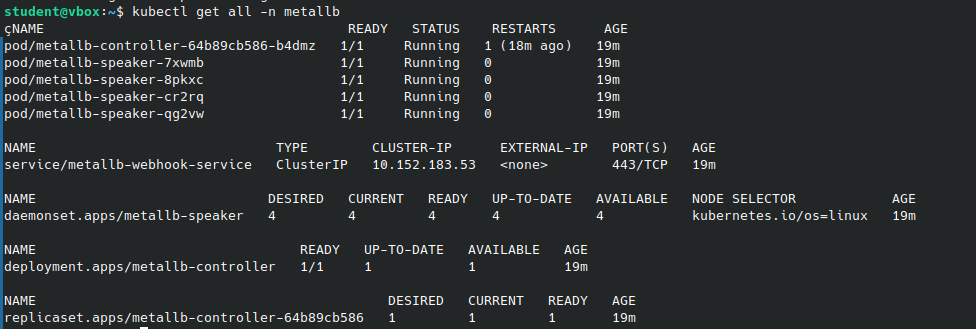
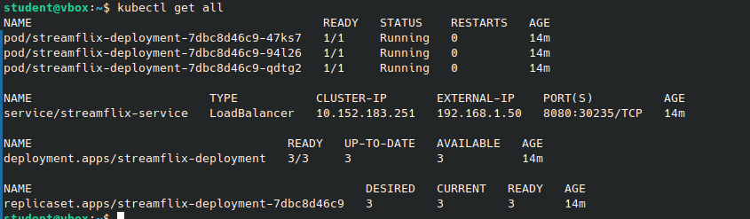
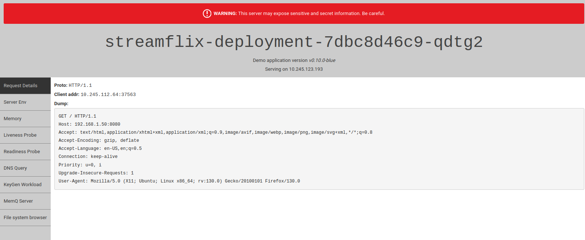
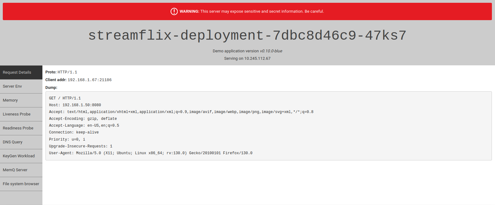
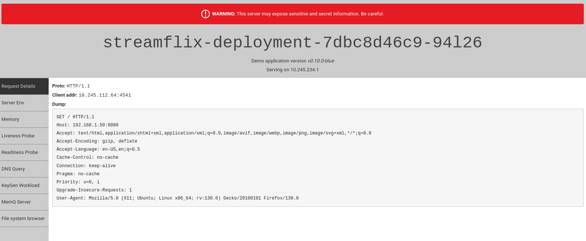
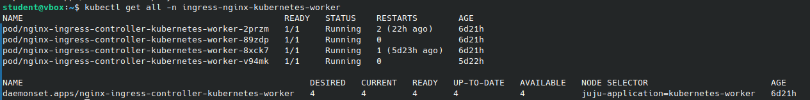
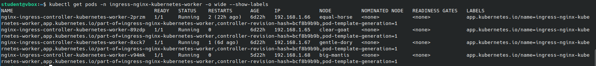
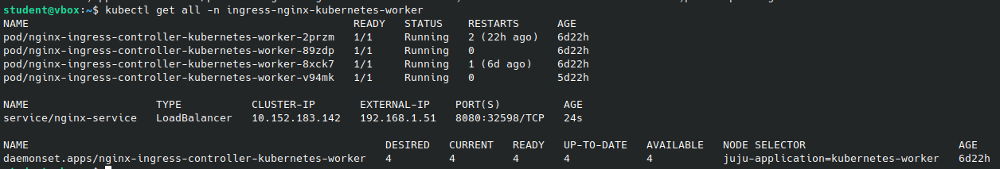
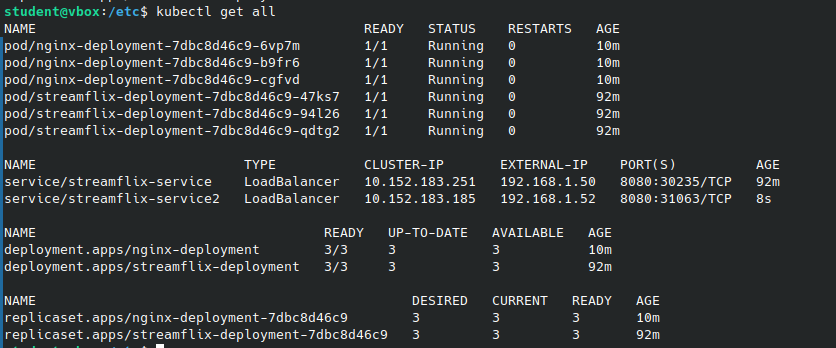
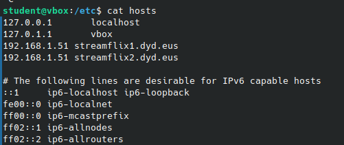

# PRÁCTICA 5

## APARTADO 1: LoadBalancer
Un **LoadBalancer** (balanceador de carga) es un componente esencial en entornos de red en los que se distribuye el tráfico de red entre varios servidores o servicios. Su objetivo principal es garantizar la alta disponibilidad y optimizar el uso de recursos al equilibrar la carga de trabajo.

En Kubernetes el tipo **LoadBalancer** asigna una IP a un balanceador de carga externo, es decir, no viene incluido en Kubernetes, por lo que lo tiene que proporcionar el proveedor de nube.

### A. Instalar MetalLB
**MetalLB** es una implementación de **LoadBalancer** para clústeres de Kubernetes en entornos donde no se dispone de un balanceador de carga nativo, como en instalaciones on-premise o en máquinas virtuales locales. **MetalLB** proporciona soporte para los tipos de servicios **LoadBalancer**, permitiendo asignar direcciones IP externas a servicios dentro del clúster.

En entornos locales (***bare-metal***), Kubernetes no ofrece un **LoadBalancer** nativo como en proveedores cloud. **MetalLB** resuelve este problema al proporcionar un balanceador de carga configurable que puede integrarse en estos entornos.

Para instalar **MetalLB**, hemos utilizado **Helm**, un gestor de paquetes para Kubernetes que simplifica la instalación y gestión de aplicaciones en el clúster.

> [!NOTE]
> La instalación de Helm se realizó en la Práctica 3

Los comandos que se han ejecutado son los siguientes:
- Añadir el repositorio de charts de **Bitnami**:
```bash
helm repo add bitami https://charts.bitnami.com/bitnami
```

- Actualizar la lista de charts disponibles en el repositorio:
```bash
helm repo update
```

- Instalar **MetalLB** en el espacio de nombres `metallb`, creando el namespace en caso de que no exista:
```bash
helm install -n metallb metallb bitnami/detallb --create-namespace
```

#### Configuración de MetalLB
Una vez instalado **MetalLB**, es necesario configurarlo para asignar rangos de direcciones IP disponibles para los servicios tipo **LoadBalancer**. Esto se hace mediante un fichero de configuración YAML. El archivo `metallb.yaml` contiene la siguiente configuración:

```yaml
apiVersion: metallb.io/v1beta1
kind: L2Advertisement
metadata:
  name: metallb-name
  namespace: metallb
spec:
  ipAddressPools:
  - metallbpool
---
apiVersion: metallb.io/v1beta1
kind: IPAddressPool
metadata:
  name: metallbpool
  namespace: metallb
spec:
  addresses:
  - 192.168.1.50-192.168.1.60
```
#### Características importantes del fichero de configuración:
- **Namespace**: El namespace especificado es `metallb`.

- **L2Advertisement**: Define cómo se van a anunciar las direcciones IP disponibles.

- **IPAddressPool**: Especifica el rango de direcciones IP (en este caso, de `192.168.1.50` a `192.168.1.60`) que se asignarán a los servicios tipo **LoadBalancer**.

> [!NOTE]  
> Este rango de direcciones está reservado desde el controlador MaaS (***Reserved range***), para que no se puedan asignar dinámicamente.

Una vez cofigurado se ha desplegado el YAML de la siguiente forma:
```bash
kubectl apply -f metallb.yaml
```

En esta imagen se aprecían los recursos que se han desplegado con el nameservice `metallb`:




### B. Cambiar el servicio kuard de la práctica anterior a tipo LoadBalancer
Para probar el funcionamiento del **LoadBalancer**, hemos reutilizado el despliegue (`deployment`) y el servicio (`service`) de la práctica anterior. Sin embargo, en esta práctica hemos modificado el tipo de servicio a `LoadBalancer` para aprovechar la funcionalidad proporcionada por **MetalLB**.


#### Fichero `deployment.yaml`:
```yaml
apiVersion: apps/v1                   # Versión de la API para el recurso Deployment
kind: Deployment                      # Tipo de recurso: Deployment
metadata:                             # Metadatos del Deployment
  name: streamflix-deployment         # Nombre del Deployment
spec:                                 # Especificación del Deployment
  replicas: 3                         # Número deseado de réplicas (pods)
  selector:                           # Selector para gestionar los pods de este Deployment
    matchLabels:                      # Define etiquetas que los pods deben tener para ser gestionados por este Deployment
      app: kuard                      # Etiqueta que deben tener los pods para ser gestionados por este Deployment
  template:                           # Template del pod, describe cómo serán los pods del Deployment
    metadata:                         # Metadatos del pod template
      labels:                         # Etiquetas aplicadas a los pods creados por el Deployment
        app: kuard                    # Etiqueta utilizada para identificar los pods
    spec:                             # Especificación del pod
      containers:                     # Lista de contenedores dentro del pod
        - image: gcr.io/kuar-demo/kuard-amd64:blue # Imagen del contenedor
          name: streamflix-container  # Nombre del contenedor
          ports:                      # Lista de puertos expuestos por el contenedor
            - containerPort: 8080     # Puerto expuesto por el contenedor dentro del pod
              protocol: TCP           # Protocolo del puerto, en este caso TCP  
```
#### Características destacables del `deployment.yaml`:
- **Nombre**: El Deployment se llama `streamflix-deployment`.

- **Réplicas**: Se crean 3 réplicas de los pods.

- **Selector**: Se asegura de que el Deployment administre únicamente los pods etiquetados con `app: kuard`.

- **Contenedor**: Usa la imagen `gcr.io/kuar-demo/kuard-amd64:blue` y expone el puerto interno `8080` con protocolo TCP.

#### Fichero `services.yaml`:
```yaml
apiVersion: v1              # Versión de la API
kind: Service               # Tipo de objeto
metadata:                   # Metadatos del objeto
  name: streamflix-service  # Nombre del servicio
spec:                       # Especificaciones del servicio
  ports:                    # Puertos del servicio
  - port: 80                # Puerto expuesto
    targetPort: 8080        # Puerto al que se redirige
    protocol: TCP           # Protocolo utilizado
  selector:                 # Selección de pods
    app: kuard              # Etiqueta para seleccionar los pods
  type: LoadBalancer        # Tipo de servicio
```
#### Características destacables del `services.yaml`:
- **type**: El servicio se ha configurado como `LoadBalancer`.

- **name**: El servicio se llama `streamflix-service`.

- **app**: Selecciona los pods que tienen la etiqueta `app:
 kuard`.

- **port**: Expone el puerto `80` para las conexiones externas.

- **targetPort**: Redirige las solicitudes al puerto interno `8080` del pod.

> [!NOTE]
> Al no indicar el `namespace`, tanto el Deployment como el Service se desplegarán en el namespace configurado por defecto, que en este caso es `streamflix`.

#### Comandos utilizados para desplegar:
Para desplegar los recursos, hemos utilizado los siguientes comandos:
```bash
kubectl apply -f deployment.yaml
kubectl apply -f services.yaml
```

De esta forma, hemos podido comprobar si se ha desplegado todo correctamente:



En la imagen anterior, se observa cómo el servicio ha sido asignado al rango de IPs configurado en **MetalLB**. En este caso, la IP externa asignada es `192.168.1.50`. Esto confirma que el servicio está listo para recibir tráfico externo.

> [!NOTE]
> A lo largo de la práctica, se han realizado actualizaciones en los ficheros YAML para corregir algunas configuraciones. Como resultado, la configuración mostrada en los ficheros y la imagen pueden diferir ligeramente. Un ejemplo de esto es el puerto en el que se expone el servicio.

### C. Acceder al servicio mediante IP externa y comprobar que se balancea
Para completar este apartado, se ha accedido a la IP externa asignada al servicio. Cada vez que se realiza una conexión, el **LoadBalancer** distribuye la carga entre los tres pods desplegados. Los pods devuelven información detallada sobre su estado, incluyendo la dirección IP interna que tienen dentro de la red Kubernetes.

Al conectar repetidamente, se obtiene la información de los tres pods, lo que permite verificar que el **LoadBalancer** está funcionando correctamente. Cada conexión es redirigida a un pod diferente, confirmando que la carga se balancea correctamente entre ellos.

Esto se puede observar en las siguientes imágenes, donde se muestra la información de los tres pods:





Las direcciones IP de lo nodos son: 10.245.123.193, 10.245.112.67 y 10.245.234.1. 
De este modo, se comprueba que el LoadBalancer está equilibrando eficazmente el tráfico entre los pods, asegurando la alta disponibilidad del servicio.

## APARTADO 2: Ingress

Ingress es un recurso avanzado de Kubernetes que permite gestionar el acceso a los servicios dentro de un clúster desde el exterior. A diferencia de los servicios tradicionales tipo `NodePort` o `LoadBalancer`, que operan a nivel de red (capa L4, es decir, TCP/UDP), Ingress permite un balanceo a nivel de aplicación (capa L7), ofreciendo funcionalidades más avanzadas para enrutar el tráfico y controlar cómo los servicios responden a las solicitudes.

Los servicios básicos en Kubernetes realizan un balanceo de carga a nivel L4:

- **NodePort**: Proporciona un puerto único para cada servicio, que se expone en todos los nodos del clúster. El tráfico entrante a ese puerto se redirige al servicio correspondiente.
- **LoadBalancer**: A diferencia de `NodePort`, este servicio asigna una IP externa diferente para cada servicio, de modo que el tráfico entrante se balancea automáticamente entre las réplicas del servicio.

Sin embargo, Ingress opera a un nivel superior (L7) y permite realizar balanceo de carga y enrutar el tráfico HTTP/HTTPS de manera más específica. Entre sus capacidades destacan:

1. **Virtual Hosting**: Con Ingress, es posible configurar múltiples servicios en un mismo clúster, diferenciándolos según el host de la cabecera HTTP (por ejemplo, `streamflix1.dyd.eus` y `streamflix2.dyd.eus`). Esto permite asignar diferentes servidores a cada nombre de dominio o subdominio, sin necesidad de exponer múltiples IPs externas. 

2. **Reverse Proxy**: Ingress también actúa como un reverse proxy, lo que significa que puede enrutar las solicitudes de entrada no solo basándose en el host, sino también en la URL solicitada. Esto permite realizar balanceo de carga avanzado, enrutamiento según la URL (por ejemplo, `/movies`, `/tvshows`), caché de contenido, reescritura de URLs, y mucho más.

### Exponer un servico ingress-nginx de tipo LoadBalancer entre los pods ingress-nginx-kubernetes-worker
En el entorno de Charmed Kubernetes, ya viene instalado un controlador Ingress llamado ingress-nginx-kubernetes-worker. Este controlador debe ser configurado adecuadamente para exponer los servicios de Kubernetes al exterior. Para ello, se utiliza el comando kubectl get all -n nginx para visualizar los recursos desplegados en el namespace nginx.

Comando utilizado para ver los recursos desplegados:
```bash
kubectl get all -n ingress-nginx-kubernetes-worker
```


En la imagen se muestran los siguientes recursos:

- **Pods**: Hay desplegados varios pods del controlador `nginx-ingress-controller-kubernetes-worker`, todos en estado `Running` y con diferentes tiempos de vida y reinicios.
  
- **DaemonSet**: Hay desplegado un DaemonSet llamado `nginx-ingress-controller-kubernetes-worker` con un total de 4 réplicas deseadas y 4 disponibles. Este DaemonSet asegura que cada nodo tenga una réplica del pod del controlador Ingress, y todas las réplicas están disponibles y operativas.

#### Configuración para exponer el Ingress

Una vez identificados los elementos y pods del controlador Ingress, se procede a configurar un Ingress para exponer los servicios necesarios. Para ello, se consulta la etiqueta (label) de los pods del namespace `nginx` con el siguiente comando:

```bash
kubectl get pods -n ingress-nginx-kubernetes-worker -o wide --show-labels
```


Una vez identificadas las etiquetas, se configura el servicio Ingress con el siguiente archivo YAML, denominado `streamflix-ingress.yaml`:

```yaml
apiVersion: v1       # Versión de la API
kind: Service        # Tipo de objeto
metadata:            # Metadatos del objeto
  name: nginx-service
  namespace: ingress-nginx-kubernetes-worker
spec:                # Especificaciones del servicio
  ports:             # Puertos del servicio
  - port: 80       # Puerto expuesto
    targetPort: 8080 # Puerto al que se redirige
    protocol: TCP    # Protocolo utilizado
  selector:          # Selección de pods
    app.kubernetes.io/name: ingress-nginx-kubernetes-worker
    app.kubernetes.io/part-of: ingress-nginx-kubernetes-worker
    controller-revision-hash: bcf8b9b9b
  type: LoadBalancer    # Tipo de servicio
```
### Características destacables de `service-nginx.yaml`

- **kind**: El tipo de objeto es un `Service`, que se utiliza para exponer una aplicación que se ejecuta en un conjunto de Pods de Kubernetes.
- **metadata**:
  - **name**: El nombre del servicio es `nginx-service`.
  - **namespace**: El servicio está en el namespace `ingress-nginx-kubernetes-worker`, lo que lo aísla dentro de este entorno específico.
  
- **spec**:
  - **ports**: El servicio expone el puerto `80` (puerto accesible externamente) y redirige las solicitudes al puerto `8080` del contenedor del pod correspondiente, utilizando el protocolo TCP.
  - **selector**: Este campo especifica las etiquetas que el servicio usa para seleccionar los pods a los cuales debe redirigir el tráfico. En este caso, el selector está basado en las siguientes etiquetas:
    - `app.kubernetes.io/name: ingress-nginx-kubernetes-worker`
    - `app.kubernetes.io/part-of: ingress-nginx-kubernetes-worker`
    - `controller-revision-hash: bcf8b9b9b`
  - **type**: Se ha definido como un `LoadBalancer`, lo que indica que Kubernetes configurará un balanceador de carga externo para el servicio, asignando una IP externa para acceder al servicio.

En la siguiente imagen se puede observar cómo se ha agregado este servicio (con la IP externa 192.168.1.51) a los recursos desplegados:



### b.Hacer un segundo Deployment y servicio similar al de la práctica anterior
Para probar el servicio Ingress, se hará un balanceo entre dos servicios que estarán ligados a la misma dirección IP (la del servicio `nginx: 192.168.1.51`), pero con dos nombres de dominio diferentes: `streamflix1.dyd.eus` y `streamflix2.dyd.eus`, como se mencionó anteriormente.

Antes de configurar el Ingress para realizar este balanceo de carga, es necesario desplegar un segundo Deployment y Servicio. Este segundo conjunto será idéntico al primero, pero con nombres diferentes para no generar conflictos. A continuación, se describen los archivos YAML utilizados para crear estos recursos.

`deploy-nginx.yaml`:
```yaml
apiVersion: apps/v1   # Versión de la API para el recurso Deployment
kind: Deployment      # Tipo de recurso: Deployment
metadata:             # Metadatos del Deployment
  name: nginx-deployment         # Nombre del Deployment
spec:                 # Especificación del Deployment
  replicas: 3         # Número deseado de réplicas (pods)
  selector:           # Selector para gestionar los pods de este Deployment
    matchLabels:      # Define etiquetas que los pods deben tener para ser gestionados por este Deployment
      app: kuard      # Etiqueta que deben tener los pods para ser gestionados por este Deployment
  template:           # Template del pod, describe cómo serán los pods del Deployment
    metadata:         # Metadatos del pod template
      labels:         # Etiquetas aplicadas a los pods creados por el Deployment
        app: kuard    # Etiqueta utilizada para identificar los pods
    spec:             # Especificación del pod
      containers:     # Lista de contenedores dentro del pod
        - image: gcr.io/kuar-demo/kuard-amd64:blue # Imagen del contenedor
          name: streamflix-container # Nombre del contenedor
          ports:      # Lista de puertos expuestos por el contenedor
            - containerPort: 8080 # Puerto expuesto por el contenedor dentro del pod
              protocol: TCP       # Protocolo del puerto, en este caso TCP
```
> [!NOTE]
> El nombre elegido para el Deployment (nginx-deployment) puede no ser el más adecuado. Aunque funcione correctamente en la máquina, el nombre puede resultar confuso para un humano, ya que hace referencia a NGINX pero no está relacionado directamente con el servicio de balanceo. Sería más conveniente elegir un nombre más específico, como streamflix-deployment2, para hacerlo más intuitivo.

`streamflix-service2.yaml`:
```yaml
apiVersion: v1       # Versión de la API
kind: Service        # Tipo de objeto
metadata:            # Metadatos del objeto
  name: streamflix-service2        # Nombre del servicio
spec:                # Especificaciones del servicio
  ports:             # Puertos del servicio
  - port: 80       # Puerto expuesto
    targetPort: 8080 # Puerto al que se redirige
    protocol: TCP    # Protocolo utilizado
  selector:          # Selección de pods
    app: kuard       # Etiqueta para seleccionar los pods
  type: LoadBalancer    # Tipo de servicio
```

Este Deployment y Service son funcionalmente idénticos al primero, pero con un nombre diferente. A continuación, se muestra una imagen que visualiza todos los recursos desplegados, incluyendo los dos Deployments y los Services:




### C. Dar de alta en el /etc/hosts del cliente dos nombres diferentes asociados a la IP del servicio ingress-nginx

Para que el balanceo de carga utilice diferentes nombres de dominio, es necesario que las peticiones de esos nombres de dominio sean redirigidas a la misma IP. En un entorno de pruebas, donde no se requiere configurar un servidor DNS, se puede modificar directamente el archivo `/etc/hosts` del cliente para asociar los nombres de dominio con la dirección IP del servicio `ingress-nginx`. De esta manera, cualquier solicitud realizada a los nombres de dominio definidos será resuelta localmente sin necesidad de consultar un servidor DNS.

En este caso, se han añadido las siguientes entradas al archivo `/etc/hosts`:

```
192.168.1.51 streamflix1.dyd.eus
192.168.1.51 streamflix2.dyd.eus
```

Estas entradas permiten que las peticiones a `streamflix1.dyd.eus` y `streamflix2.dyd.eus` se resuelvan hacia la dirección IP `192.168.1.51`, que corresponde a la IP externa del LoadBalancer asociado al servicio `ingress-nginx`.

#### Ventajas de esta configuración:
- **Simplicidad:** Al modificar el archivo `/etc/hosts`, se evita la necesidad de configurar un servidor DNS completo, lo que simplifica la implementación para pruebas locales o de desarrollo.
- **Prioridad:** En los sistemas Linux, el archivo `/etc/hosts` se consulta antes de realizar una consulta DNS externa. Esto asegura que las peticiones a los nombres de dominio definidos en este archivo se resuelvan localmente, sin necesidad de conexión a Internet.
- **Pruebas controladas:** Es suficiente para los fines de esta práctica, ya que el entorno es controlado y no se requiere una infraestructura de DNS más compleja.

La siguente imagen muestra el archivo /etc/hosts ya cofigurado: 




### D. Crear un Ingress que en función del nombre del host dirija la petición a uno u otro servicio

Para configurar correctamente el balanceo de carga utilizando el controlador Ingress, se ha creado el archivo ingress.yaml. Este archivo contiene la configuración necesaria para dirigir las peticiones a dos servicios diferentes dependiendo del nombre del host en la solicitud HTTP.

A continuación, se presenta el contenido del archivo YAML `ingress.yaml` : 

```yaml
apiVersion: networking.k8s.io/v1
kind: Ingress
metadata:
  name: streamflix-ingress
spec:
  rules:
  - host: "streamflix1.dyd.eus"
    http:
      paths:
      - path: /
        pathType: Prefix
        backend:
          service:
            name: streamflix-service
            port:
              number: 80
  - host: "streamflix2.dyd.eus"
    http:
      paths:
      - path: /
        pathType: Prefix
        backend:
          service:
            name: streamflix-service2
            port:
              number: 80
```

#### Características destacables del `ingress.yaml`

- **kind**: Se define el  tipo de objeto definido como `Ingress`, que en Kubernetes se utiliza para gestionar el acceso a los servicios dentro del clúster mediante HTTP o HTTPS.

- **name**: Se define el nombre del recurso Ingress, `streamflix-ingress`. 

- **rules**:  Define las reglas de enrutamiento:

  - **Primera regla**:La primera regla indica que el tráfico que llegue al host `streamflix1.dyd.eus` será enrutado hacia al servicio llamado `streamflix-service`, que debe estar configurado previamente en Kubernetes para manejar estas solicitudes. El puerto 80 es el puerto de escucha que el servicio `streamflix-service` expone para recibir el tráfico. Este puerto debe coincidir con el puerto configurado en el archivo YAML del servicio correspondiente.
   - **Primera regla**: La segunda regla indica que el tráfico que llegue al host `streamflix2.dyd.eus` será enrutado hacia al servicio llamado `streamflix-service2`, que debe estar configurado previamente en Kubernetes para manejar estas solicitudes. El puerto 80 es el puerto de escucha que el servicio `streamflix-service2` expone para recibir el tráfico. Este puerto debe coincidir con el puerto configurado en el archivo YAML del servicio correspondiente.


### E. Conectarse desde el navegador web empleando los diferentes nombres y comprobar que responde el servicio asociado a ese nombre y que se balancea entre los pods del servicio

> [!NOTE]
> En la práctica de clase se llego hasta aquí y conseguimos verificar el servicio de Ingress desde el navegador web. 

## APARTADO 3
